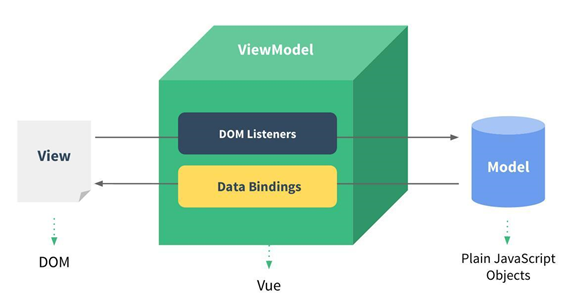

## 邂逅Vue

 ### 1 认识Vue

Vue (读音 /vjuː/，类似于 **view**) 是一套用于构建用户界面的**渐进式框架**。 

#### 1.1 渐进式

- 渐进式意味着你可以将Vue作为你应用的一部分嵌入其中，带来更丰富的交互体验。

- 或者如果你希望将更多的业务逻辑使用Vue实现，那么Vue的核心库以及其生态系统。

- 比如Core+Vue-router+Vuex，也可以满足你各种各样的需求。

#### 1.2 Vue的特点与功能

- 解耦视图和数据

- 可复用的组件

- 前端路由技术

- 状态管理

- 虚拟DOM

### 2 Vue.js安装

#### 2.1 直接CDN引入

```html
<!-- 开发环境版本，包含了有帮助的命令行警告 --> 
<script src="https://cdn.jsdelivr.net/npm/vue/dist/vue.js"></script>
<!-- 生产环境版本，优化了尺寸和速度 -->
<script src="https://cdn.jsdelivr.net/npm/vue"></script>
```

#### 2.2 下载和引入

```html
开发环境 https://vuejs.org/js/vue.js 
生产环境 https://vuejs.org/js/vue.min.js
```

#### 2.3 NPM安装

使用webpack + CLI


### 3 Vue初体验

#### 3.1 Hello Vue

```html
//html
<div id="app">
	<div>
		{{message}}
	</div>
</div>
//js
<script src="js/vue.js"></script>
<script>
    new Vue({
      el: '#app',
      data: {
        message: 'hello'
      }
    })
</script>
```

#### 3.2 列表渲染

```html
//html
<div id="app">
	<ul>
		<li v-for="item in movies">{{item}}</li>
	</ul>
</div>
//js
<script>
    new Vue({
      el: '#app',
      data: {
			movies: ['钢铁侠', '蜘蛛侠', '美国队长', '复仇者联盟']
      }
    })
</script>
```

#### 3.3 案例-计数器

```html
//html
<div id="app">
	<h2>当前计数：{{count}}</h2>
	<button @click="increment">+</button>
	<button @click="decrement">-</button>
</div>
//js
<script src="js/vue.js"></script>
<script>
  new Vue({
    el: '#app',
    data: {
      count: 0
    },
	methods: {
      increment() {
        this.count++
	  },
	  decrement() {
        this.count--
	  }
	}
  })
</script>
```

#### 3.4 Vue中的MVVM

##### 3.4.1 什么是MVVM

**MVVM**（ **Model–view–viewmodel** ）是一种软件架构模式。

 MVVM有助于将图形用户界面的开发与业务逻辑或后端逻辑（数据模型）的开发分离开来，这是通过置标语言或GUI代码实现的。MVVM的视图模型是一个值转换器，这意味着视图模型负责从模型中暴露（转换）数据对象，以便轻松管理和呈现对象。在这方面，视图模型比视图做得更多，并且处理大部分视图的显示逻辑。视图模型可以实现中介者模式，组织对视图所支持的用例集的后端逻辑的访问。 

##### 3.4.2 Vue中的MVVM



- View层：
  - 视图层
  - 在我们前端开发中，通常就是DOM层。
  - 主要的作用是给用户展示各种信息。

- Model层：
  - 数据层
  - 数据可能是我们固定的死数据，更多的是来自我们服务器，从网络上请求下来的数据。
  - 在我们计数器的案例中，就是后面抽取出来的obj，当然，里面的数据可能没有这么简单。

- VueModel层：
  - 视图模型层
  - 视图模型层是View和Model沟通的桥梁。
  - 一方面它实现了Data Binding，也就是数据绑定，将Model的改变实时的反应到View中
  - 另一方面它实现了DOM Listener，也就是DOM监听，当DOM发生一些事件(点击、滚动、touch等)时，可以监听到，并在需要的情况下改变对应的Data。

##### 3.4.3 计数器的MVVM

- 计数器的MVVM
  - 我们的计数器中就有严格的MVVM思想
    - View依然是我们的DOM
    - Model就是我们我们抽离出来的obj
    - ViewModel就是我们创建的Vue对象实例
  - 它们之间如何工作呢？
    - 首先ViewModel通过Data Binding让obj中的数据实时的在DOM中显示。
    - 其次ViewModel通过DOM Listener来监听DOM事件，并且通过methods中的操作，来改变obj中的数据。

- 有了Vue帮助我们完成VueModel层的任务，在后续的开发，我们就可以专注于数据的处理，以及DOM的编写工作了。

##### 3.4.4 创建Vue示例传入的options

- 我们在创建Vue实例的时候，传入了一个对象options。  
- noptions中可以包含哪些选项呢？
  - 官方文档：  [https://cn.vuejs.org/v2/api/#%E9%80%89%E9%A1%B9-%E6%95%B0%E6%8D%AE](https://cn.vuejs.org/v2/api/)  
- 常用选项:
  - el
  - data
  - methods
  - ……

##### 3.4.5 Vue的生命周期


